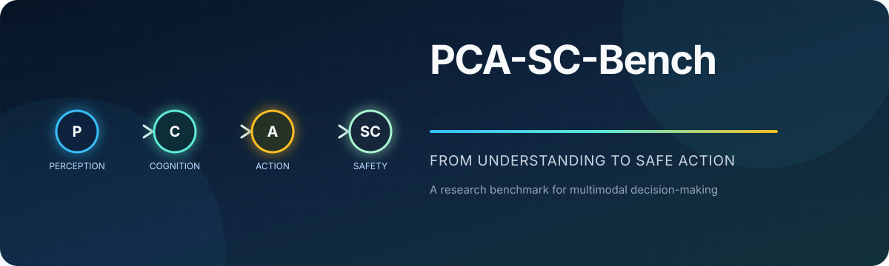

  

   

  
  
  

  **评估多模态智能体能否从场景理解一贯地走向安全行动。**

  [English](README.md) · [简体中文](README_zh-CN.md)

---

## 项目概览

PCA-SC-Bench 是一项研究型基准，用于分析视觉场景决策中的**感知–认知–行动**链路及其**安全一致性**。项目关注一个简单但重要的问题：智能体不仅要能理解场景并进行推理，其最终行动是否也能与理解结果及安全约束保持一致？

当前研究场景聚焦于车站类公共环境中的安全决策。评测框架从以下互补视角进行分析：

| 维度 | 关注内容 |
|:--|:--|
| **感知** | 能否识别与任务相关的场景条件和潜在风险 |
| **认知** | 能否对目标、约束与安全影响进行连贯推理 |
| **行动** | 所选行动是否符合当前情境 |
| **安全一致性** | 感知、推理与行动在安全约束下是否保持一致 |

## 发布状态

> [!IMPORTANT]
> 本仓库目前是**公开预发布主页**。现阶段不包含论文和研究资料，也未公开任何基准样本、标注、模型输出、提示词、实验配置、定量结果或稿件材料。

团队正在准备兼顾责任使用与可复现性的公开版本。待相关评审、授权与隐私检查完成后，将通过本仓库公布可用性信息。

## 计划公开内容

未来的公开资料预计包含：

- 基准任务与数据格式说明；
- 经过脱敏的评测工具和配置示例；
- 说明预期用途和局限性的数据卡与模型卡；
- 可复现说明与经验证的参考流程；
- 与最终发表版本对应的引用信息。

具体公开范围可能根据评审与合规检查进行调整，目前尚未承诺发布日期。

## 责任使用

PCA-SC-Bench 面向评测、鲁棒性和安全决策研究。基准分数不应被视为模型已可在现实公共环境中安全部署的证明。真实部署仍需独立验证、领域专家参与及合适的运行保障。

请勿通过本仓库索取未公开数据集、稿件草稿、评审材料、凭据或未发表结果。如发现安全或隐私问题，请按 [SECURITY.md](SECURITY.md) 中的方式私下报告。

## 参与贡献

基准资料尚未开放外部贡献。欢迎提交不涉及敏感信息的文档修正与建议；发起 Pull Request 前请阅读 [CONTRIBUTING.md](CONTRIBUTING.md)。

## 引用

与本项目相关的研究正式公开后，我们会补充引用信息。在此之前，请直接链接本仓库，不建议创建非官方引用。

## 许可证

本仓库当前已包含的内容使用 [MIT License](LICENSE)。未来公开的基准数据、图像、标注、模型输出及其他研究资料可能使用不同条款，届时将单独说明。

---

  为审慎评测而构建，只在资料准备完善后发布。

